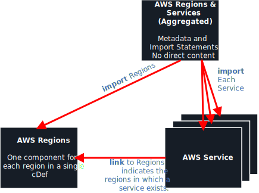
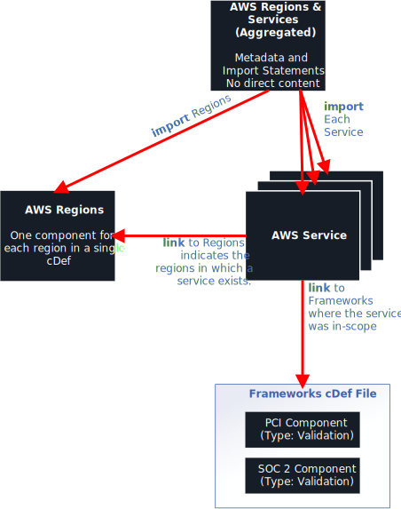

# AWS Component Definitions

AWS component defintions describe AWS regions and services. The content of these component definitions is sparse, but will increase over time based on custome feedback. Adoption of OSCAL component definitions better enable compliance as code, machine-readable security documentation, and continuous assessment goals. 


## File Organization

The component definition file structure is as follows:

```
\component-definitions
  - AWS_Regions-and-Services_oscal_component-definition.json
  - AWS_Regions_oscal_component-definition.json
  \services
    - [service_name]_oscal_component-definition.json

```

`AWS_Regions-and-Services_oscal_component-definition.json` includes import statements for all other AWS component definition files. This is designed so that a single link can expose OSCAL tools to all available AWS component definition content. 

`AWS_Regions_oscal_component-definition.json` is a single file that contains one OSCAL component for each AWS Region. 

The `services` sub-folder contains one OSCAL component definition file per included AWS service. If a service you need is missing, please open an issue and let us know. 

Every file in the `services` folder follows the pattern `[service_name]_oscal_component-definition.json`. The `[service_name]` is replaced with the name of the actual service.


This diagram depicts the relationship between each of the files:




---


## OSCAL Representation

The AWS component definitions are designed to use core OSCAL to the greatest degree practical. 

For AWS services, attributes fall into one of three scenarios:
**Scenario 1.** A core OSCAL field or property exists for the attribute.
**Scenario 2.** No core OSCAL field nor property exists for the attribute and the attribute has automation significance.
**Scenario 3.** No core OSCAL field nor property exists for the attribute and the attribute does not have automation significnae. (Intended only for human reference.)

These three scenarios are represented in the OSCAL component definitions as follows:

**Scenario 1.** The appropriate core OSCAL field or property is used.
**Scenario 2.** An OSCAL property extension is used in the `http://aws.amazon.com/ns/oscal` namespace (`ns`). 
**Scenario 3.** A core OSCAL "label" property is used with a `group` attribute of either "service" or "marketing" and a `class` attribute that reflects the internal AWS field name.

## Examples

This is an excerpt from the EC2 Component Definition in YAML format.

1. Core OSCAL fields include: `version`
2. OSCAL extension properties include: `service-id`, `availability`, `apiEndpointPrefix`, `arnNamespace`, `cloudTrailEventSource`
3. Core OSCAL "label" properties represent: `serviceFullName`, `marketingName`

```yaml
    - name: service-id
      value: EC2
      ns: http://aws.amazon.com/ns/oscal

    - name: version
      value: 2016-11-15

    - name: availability
      value: REGIONAL
      ns: http://aws.amazon.com/ns/oscal
    - name: availability
      value: ZONAL
      ns: http://aws.amazon.com/ns/oscal
    - name: availability
      value: SUBZONAL
      ns: http://aws.amazon.com/ns/oscal

    - name: label
      group: service
      class: serviceFullName
      value: Elastic Compute Cloud (EC2)

    - name: label
      group: marketing
      class: marketingName
      value: Amazon Elastic Compute Cloud (EC2)

    - name: apiEndpointPrefix
      value: ec2
      ns: http://aws.amazon.com/ns/oscal

    - name: arnNamespace
      value: ec2
      ns: http://aws.amazon.com/ns/oscal

    - name: cloudTrailEventSource
      value: ec2
      ns: http://aws.amazon.com/ns/oscal
```
* NOTE: YAML is used in the above example for ease of readability; however, the AWS component defintions are made available in JSON format.
---

## Future Considerations

Depending on potential usefulness or customer demand, we may expand these component definitions. If any of the following efforts are valuable to you, please let us know.

- Compliance linkages
- Compliance deployment automation
- Compliance validation automation 
- Compliance documentation content

### Compliance linkages

Under this expansion, AWS could create an additional OSCAL component definition that enumerates all applicable compliance frameworks as "validation" components.

TheEach AWS region and service could then be linked to the frameworks where the region or service was found to be compliant. This would allow a machine-readable method of determining which services are validated under a particular framework and which are not.

The resulting component definition relationships would expand as follows:




### Compliance deployment automation

This could provide automated deployment scripts that ensure a service is deployed consistent with the requirements of a specific framework. 

### Compliance deployment validation

This could provide automated validation scripts that ensure a service continues to operate with a configuration consistent with the requirements of a specific framework. 

### Compliance documentation content

This could provide documentation that describes the component configuration in alignment with the requirements of security frameworks that require such documentation.


