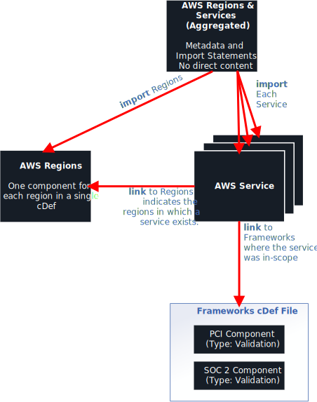

# AWS Component Definitions

AWS component definitions describe AWS regions and services. Adoption of OSCAL component definitions enables compliance as code, machine-readable security documentation, and continuous assessment goals.

All content conforms to OSCAL version 1.2.1 and is provided in JSON format.


## File Organization

The component definition file structure is as follows:

```
/catalogs
  - aws_security-hub.oscal.json
/component-definitions
  - aws_regions-and-services.oscal.json
  - aws_regions.oscal.json
  - [service_name].oscal.json
```

`aws_regions-and-services.oscal.json` includes import statements for all other AWS component definition files. This is designed so that a single link can expose OSCAL tools to all available AWS component definition content.

`aws_regions.oscal.json` is a single file that contains one OSCAL component for each AWS Region.

Each remaining file in the `component-definitions` directory represents one or more AWS services, following the pattern `[service_name].oscal.json`. If a service you need is missing, please open an issue and let us know.

See the [Component Definitions README](../component-definitions/README.md) for a full inventory of all 230 component definition files.


## Metadata

Each component definition file includes standard OSCAL metadata:

- `title` — the service or resource name
- `version` — content version (currently 0.2.x)
- `oscal-version` — OSCAL specification version (1.2.1)
- `links` — link to the public source repository
- `roles`, `locations`, `parties`, `responsible-parties` — authorship information
- `remarks` — experimental use disclaimer


## OSCAL Representation

The AWS component definitions are designed to use core OSCAL to the greatest degree practical.

For AWS services, attributes fall into one of three scenarios:

**Scenario 1.** A core OSCAL field or property exists for the attribute.
**Scenario 2.** No core OSCAL field nor property exists for the attribute and the attribute has automation significance.
**Scenario 3.** No core OSCAL field nor property exists for the attribute and the attribute does not have automation significance. (Intended only for human reference.)

These three scenarios are represented in the OSCAL component definitions as follows:

**Scenario 1.** The appropriate core OSCAL field or property is used.
**Scenario 2.** An OSCAL property extension is used in the `http://aws.amazon.com/ns/oscal` namespace (`ns`).
**Scenario 3.** A core OSCAL "label" property is used with a `group` attribute of either "service" or "marketing" and a `class` attribute that reflects the internal AWS field name.


### Service Components

Each service component (`type: "service"`) includes:

- `description` — a human-readable description of the service
- `props` — service properties including:
  - `service-id` — unique service identifier (ns: `http://aws.amazon.com/ns/oscal`)
  - `version` — API version
  - `availability` — deployment scope such as REGIONAL, ZONAL, or SUBZONAL (ns: `http://aws.amazon.com/ns/oscal`)
  - `label` — human-readable names (group: "marketing", class: "marketingName")
  - `apiEndpointPrefix` — API endpoint prefix (ns: `http://aws.amazon.com/ns/oscal`)
  - `arnNamespace` — ARN namespace (ns: `http://aws.amazon.com/ns/oscal`)
  - `cloudTrailEventSource` — CloudTrail event source (ns: `http://aws.amazon.com/ns/oscal`)
  - `lifecycle-stage` — service lifecycle stage, e.g. "generally-available" (ns: `http://aws.amazon.com/ns/oscal`)
  - `iamServicePrefix` — IAM service prefix (ns: `http://aws.amazon.com/ns/oscal`)
- `links` — references to AWS documentation and region availability (via `provided-by` links to the AWS Regions component definition)


### AWS Config Rule Components

Where applicable, component definition files also include AWS Config Rule components (`type: "software"`) that represent automated compliance checks. These components include:

- `description` — what the rule checks
- `props`:
  - `ConfigRuleId` — the AWS Config Rule identifier (ns: `http://aws.amazon.com/ns/oscal`)
  - `asset-type` — set to "automated-inspection"
- `control-implementations` — links each Config Rule to the AWS Security Hub controls it implements, referencing the [AWS Security Hub Controls catalog](../catalogs/aws_security-hub.oscal.json) via back-matter

Currently, 67 component definition files include Security Hub control implementations with associated Config Rules.


## Examples

This is an excerpt from the EC2 Component Definition in YAML format.

1. Core OSCAL fields include: `version`
2. OSCAL extension properties include: `service-id`, `availability`, `apiEndpointPrefix`, `arnNamespace`, `cloudTrailEventSource`, `lifecycle-stage`, `iamServicePrefix`
3. Core OSCAL "label" properties represent: `marketingName`

```yaml
    - name: service-id
      value: EC2
      ns: http://aws.amazon.com/ns/oscal

    - name: version
      value: 2016-11-15

    - name: availability
      value: REGIONAL
      ns: http://aws.amazon.com/ns/oscal
    - name: availability
      value: ZONAL
      ns: http://aws.amazon.com/ns/oscal
    - name: availability
      value: SUBZONAL
      ns: http://aws.amazon.com/ns/oscal

    - name: label
      value: Amazon Elastic Compute Cloud (EC2)
      class: marketingName
      group: marketing

    - name: apiEndpointPrefix
      value: ec2
      ns: http://aws.amazon.com/ns/oscal

    - name: arnNamespace
      value: ec2
      ns: http://aws.amazon.com/ns/oscal

    - name: cloudTrailEventSource
      value: ec2
      ns: http://aws.amazon.com/ns/oscal

    - name: lifecycle-stage
      value: generally-available
      ns: http://aws.amazon.com/ns/oscal

    - name: iamServicePrefix
      value: ec2
      ns: http://aws.amazon.com/ns/oscal
```
* NOTE: YAML is used in the above example for ease of readability; however, the AWS component definitions are made available in JSON format.
---

## Future Considerations

Depending on potential usefulness or customer demand, we may expand these component definitions. If any of the following efforts are valuable to you, please let us know.

- Compliance linkages
- Compliance deployment automation
- Compliance validation automation
- Compliance documentation content

### Compliance linkages

Under this expansion, AWS could create an additional OSCAL component definition that enumerates all applicable compliance frameworks as "validation" components.

Each AWS region and service could then be linked to the frameworks where the region or service was found to be compliant. This would allow a machine-readable method of determining which services are validated under a particular framework and which are not.

The resulting component definition relationships would expand as follows:




### Compliance deployment automation

This could provide automated deployment scripts that ensure a service is deployed consistent with the requirements of a specific framework.

### Compliance deployment validation

This could provide automated validation scripts that ensure a service continues to operate with a configuration consistent with the requirements of a specific framework.

### Compliance documentation content

This could provide documentation that describes the component configuration in alignment with the requirements of security frameworks that require such documentation.
